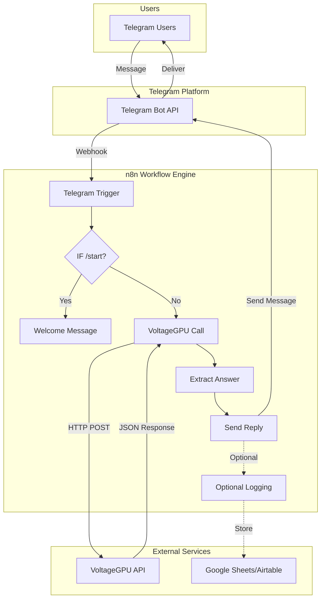

# Architecture Documentation

## 🏗️ System Overview

Le bot VoltageGPU Telegram Ask-AI est une solution serverless basée sur n8n qui orchestre les interactions entre Telegram et l'API VoltageGPU pour fournir des réponses IA intelligentes.

## 📐 Architecture Diagram



## 🔧 Components

### 1. **Telegram Bot**
- **Rôle** : Interface utilisateur principale
- **Responsabilités** :
  - Recevoir les messages des utilisateurs
  - Envoyer les réponses formatées
  - Gérer les commandes (/start, futures: /help, /plans)

### 2. **n8n Workflow Engine**
- **Rôle** : Orchestrateur central
- **Responsabilités** :
  - Gérer le flux de données
  - Router les messages selon leur type
  - Formater les requêtes/réponses
  - Gérer les erreurs

### 3. **VoltageGPU API**
- **Rôle** : Moteur d'intelligence artificielle
- **Endpoint** : `https://api.voltagegpu.com/v1/chat/completions`
- **Modèle** : DeepSeek-R1-sgtest
- **Responsabilités** :
  - Générer les réponses IA
  - Traiter le contexte de conversation

### 4. **Logging System (Optionnel)**
- **Rôle** : Analytics et monitoring
- **Options** : Google Sheets ou Airtable
- **Données collectées** :
  - Timestamp
  - User ID/Username
  - Prompt
  - Response length
  - Model used

## 🔄 Data Flow

### Message Standard
1. User envoie message → Telegram API
2. Telegram API → Webhook n8n (Telegram Trigger)
3. n8n vérifie si c'est `/start`
4. Si non → Appel VoltageGPU API
5. Parse de la réponse JSON
6. Ajout signature promo
7. Envoi réponse → Telegram API → User

### Message /start
1. User envoie `/start` → Telegram API
2. Telegram API → Webhook n8n
3. n8n détecte `/start`
4. Envoi message d'accueil (sans API call)
5. Fin du flow

## 🔐 Security Architecture

### Credentials Management
```yaml
Credentials Storage:
  - Location: n8n Credentials Store (encrypted)
  - Types:
    - Telegram Bot Token
    - VoltageGPU API Key
    - (Optional) Google/Airtable Keys
  
Environment Variables (.env):
  - Used for: Local development only
  - Never committed to Git
  
Secrets Rotation:
  - Recommended: Every 90 days
  - Process: Update in n8n UI only
```

### API Security
- **Authentication** : Bearer Token (Header)
- **HTTPS** : Obligatoire pour tous les endpoints
- **Rate Limiting** : Géré par VoltageGPU (1000 req/min)
- **Error Handling** : Fallback messages sans leak d'info

## 📊 Performance Considerations

### Latency Breakdown
- Telegram → n8n : ~50-100ms
- n8n Processing : ~10-20ms
- VoltageGPU API : ~500-2000ms (selon charge)
- n8n → Telegram : ~50-100ms
- **Total** : ~600-2200ms

### Scalability
- **Concurrent Users** : Limité par n8n instance (100-1000)
- **Messages/sec** : ~10-50 (selon config n8n)
- **Bottleneck** : VoltageGPU API rate limits

### Optimization Tips
1. Implémenter cache Redis pour questions fréquentes
2. Utiliser batch processing pour logs
3. Configurer auto-scaling n8n (cloud version)

## 🚨 Error Handling

### Error Types & Responses

| Error Type | User Message | Internal Action |
|------------|--------------|-----------------|
| API Timeout | "Désolé, réessaie dans un instant" | Log, retry x1 |
| Invalid API Key | "Service temporairement indisponible" | Alert admin |
| Rate Limit | "Trop de demandes, patiente 1 minute" | Queue message |
| Network Error | "Problème de connexion, réessaie" | Log error |
| Parse Error | "Réponse invalide reçue" | Fallback response |

## 🔄 State Management

Le bot est **stateless** par design :
- Pas de stockage de conversation
- Chaque message est indépendant
- Context passé dans chaque requête API si multi-turn

Future : Implémenter Redis pour :
- Historique de conversation (24h TTL)
- Rate limiting par user
- Cache de réponses fréquentes

## 🎯 Design Decisions

### Pourquoi n8n ?
- Visual workflow = maintenance facile
- Built-in error handling
- Credentials management sécurisé
- Extensibilité (300+ integrations)

### Pourquoi DeepSeek-R1 ?
- Excellent rapport qualité/prix
- Optimisé pour code & technique
- Latence faible
- Context window large (32k tokens)

### Pourquoi non-streaming ?
- Simplicité d'implémentation
- Compatible avec Telegram API
- Meilleur error handling
- Pas de websockets nécessaires

## 📈 Monitoring & Observability

### Métriques Clés
- Response time P50/P95/P99
- Error rate par type
- Messages par heure/jour
- Token usage (coût)
- User retention

### Alerting
- API down > 5 min
- Error rate > 5%
- Response time P95 > 5s
- Budget dépassé

## 🔮 Future Enhancements

### Court terme (1-3 mois)
- [ ] Multi-language support
- [ ] Voice message support
- [ ] Inline keyboard menus
- [ ] Basic analytics dashboard

### Moyen terme (3-6 mois)
- [ ] Conversation memory (Redis)
- [ ] Multi-model support
- [ ] Image generation
- [ ] Code execution sandbox

### Long terme (6-12 mois)
- [ ] Fine-tuned models
- [ ] Plugin system
- [ ] Self-hosted VoltageGPU nodes
- [ ] Blockchain payment integration

## 🧪 Testing Strategy

### Unit Tests
- Function `ExtractAnswer`
- Error handlers
- Message formatters

### Integration Tests
- Telegram webhook reception
- VoltageGPU API calls
- End-to-end flow

### Load Tests
- 100 concurrent users
- 1000 messages/minute
- Graceful degradation

## 📝 Deployment Checklist

- [ ] Credentials configured in n8n
- [ ] Webhook URL set in Telegram
- [ ] Error notifications configured
- [ ] Monitoring dashboard setup
- [ ] Backup workflow exported
- [ ] Documentation updated
- [ ] Security audit passed

---

*Last Updated: January 2025*
